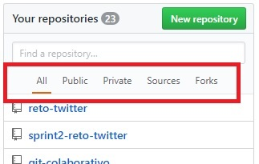

# Retos de código: Página de Laboratoria.

## Mencionar qué partes conforman el UX y qué partes conforman el UI

### UX:

* La página pueda verse en diferentes dispositivos
* Se puede compartir en las redes sociales
* Genera confianza con los ejemplos de las egresadas
* Se puede acceder a la información fácilmente
* Ver las empresas que participan es otro motivo de confianza
* La información es clara
* El blog es un elemento adicional, para más información y aparece al final
* Tiene buenas referencias
* Las opiniones hacen más genuina la página
* La página de las estudiantes explica paso a paso y genera toda la información necesaria para entender de qué va la formación
* El calendario permite visualizar las fechas disponibles para las distintas sedes
* La calidad del video depende de la conexión a internet

### UI:

*  Colores amarillos de acuerdo al logotipo de la página
* Botones Iniciales que redireccionan a otras páginas de Laboratoria
* Tamaño de las imágenes
* Logotipo de Laboratoria que redirecciona a la misma pagina
* Tamaño de los íconos de las redes sociales
* Tipo de letra
* Al posicionar sobre los íconos de las redes sociales éstas cambian de tamaño
* Tamaño de los logotipos de las empresas
* Páginas adicionales a Laboratoria
* Diseño de botones
* Tamaño de las secciones
* Forma de acomodar logotipos de las empresas
* Color del texto dependiendo si hay imagen de fondo o no
* Al posicionar sobre los botones el cursor cambia de flecha a manita
* Tamaño de los encabezados
* Texto alternativo corto
* Contiene un video
* No contiene un área de búsqueda

## Identificar los elementos de navegación de la página de Github

### Navegación Global:

### Navegación Local:

### Navegación Facetada:

### Navegación en linea (inline):

